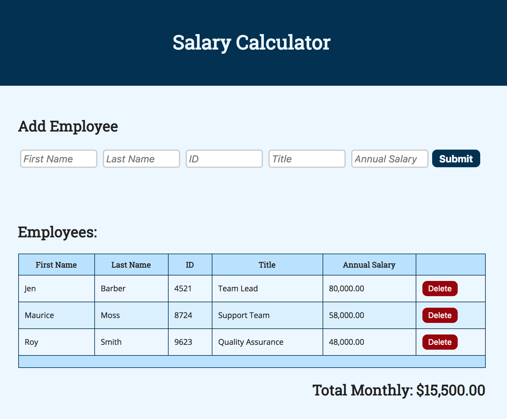

# Salary Calculator
Create an application that records employee salaries and adds salaries up to report monthly costs. 

## Installation and Setup
- Clone this repository `git clone https://github.com/mes32/Weekend1_Salary_Calc.git` and change directory `cd Weekend1_Salary_Calc/`
- Install the neccessary Node.js packages `npm install`
- Start the server `npm start`
- You should see a client-side implementation of the Salary Calculator here [http://localhost:5000](http://localhost:5000)

## Features
- The application has an input form that collects _employee first name, last name, ID number, job title, annual salary_.
- The form will *NOT* accept an incomplete set of employee data and indicates/annotates the required input fields
- When an employee is successfully submitted the input fields are cleared
- Stores and retrieves all employee and expense data on the server-side
- If the total monthly cost exceeds $20,000, add a red background color to the total monthly cost
- Each row of employee data includes a delete button. When pressed uses jQuery `.data()` to look up the associated employee object before sending an HTTP request to the server to delete that employee.

## Topics Covered
- JavaScript
- jQuery - Selectors, append, and event handling
- Node.js - Simple client/server serving a static webpage and storing important data on the server-side
- AJAX - HTTP requests to **C**reate, **R**ead, and **D**elete employee data

## Screenshot

